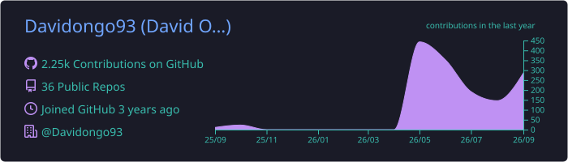
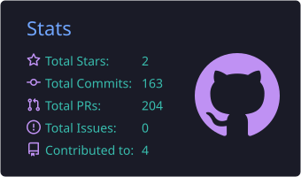
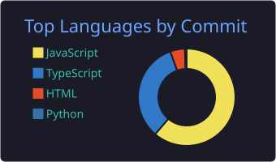

  

  
  
  
  
   
  
  
  
  

---

### 👋 Hi, I'm David

**Specialized full stack developer based in Colombia.** I spent fourteen years keeping hardware, networks and servers running before I moved into software in 2022. Now I build web products end to end, from the first call to the client's own domain.

- 🔭 **Now:** Web & SEO Developer at [DigitalYa](https://digitalya.com.ar/). I build and ship websites for law firms and professional practices, and I also take freelance projects as **Daev**.
- 🧱 **Before:** Technical Lead on **Agro Ledger**, a plant-to-batch traceability platform for a regulated crop at Colombian Cannabis Center.
- 🎯 **Strongest at:** backend with solid business logic, and taking a project from idea to production, with the domain and the metrics.
- 📚 **Learning:** the Google UX Design Professional Certificate and Anthropic's Claude Code 101 (Coursera).

  
  
  
  

### 🛠️ What I build

| | |
|---|---|
| 🌐 **Custom websites** | Multi-page corporate sites that are fast and SEO-ready, on the client's own domain. |
| 🚀 **Landing pages** | One page, one goal: turn visitors into leads. |
| 📈 **Scalable web applications** | Stores, platforms and SaaS with roles, dashboards and payments. |
| 🔒 **Robust backend logic** | APIs, transactions, scheduled jobs and integrations that hold up in production. |

### 💼 Selected work

<table>
  <tr>
    <td width="50%" valign="top">
      
       <b><a href="https://daev.space/en/work#chez-boaz-tours">Chez Boaz Tours</a></b> · Tourism · Santa Marta
       Rebuilt with online booking and a 30% deposit through Bold. <b>Mobile LCP 7.9 s → 1.6 s</b>, page weight 3.1 MB → 499 KB.
    </td>
    <td width="50%" valign="top">
      
       <b><a href="https://daev.space/en/work#colombian-cannabis-center">Agro Ledger</a></b> · Agritech · Traceability
       Plant-to-batch traceability for a regulated crop, built for audits. NestJS, PostgreSQL, Docker.
    </td>
  </tr>
  <tr>
    <td width="50%" valign="top">
      
       <b><a href="https://daev.space/en/work#opticas-apolo-vision">Ópticas Apolo Visión</a></b> · Optical retail · Bogotá
       Online store with a searchable catalogue, nationwide shipping and eye-exam booking.
    </td>
    <td width="50%" valign="top">
      
       <b><a href="https://daev.space/en/work#climb-rock">Climb Rock</a></b> · Industrial safety · Bogotá
       Their first website: six service lines and a quote request in a single tap, server-rendered on Cloudflare Workers.
    </td>
  </tr>
</table>

<a href="https://daev.space/en/work"><b>See every case, with photo galleries →</b></a>

### ⚙️ Backend

| Project | What it proves | Stack |
|---|---|---|
| **Raffle Platform API** · 2025 | Ticket purchases in a transaction with a row lock, so two buyers never get the same number. JWT with one-time codes, cron jobs, Swagger. *(private)* | NestJS · PostgreSQL · Sequelize |
| [**VideoApp API**](https://github.com/Davidongo93/videoapp-API-challenge) · 2024 | Backend challenge: users, videos, comments and likes, auth middleware, tests, OpenAPI. | Express · TypeScript · PostgreSQL |
| [**Disruptive Media**](https://github.com/Davidongo93/disruptive-media) · 2024 | Content platform in an Nx monorepo with search, sorting and pagination. | Express · MongoDB · React |
| [**SFTP → REST Refactor**](https://github.com/Davidongo93/sftp-to-rest-refactor) · 2024 | Globant code camp: a batch process over SFTP turned into a REST API. | Java · Spring · Docker |
| [**Theatrical Players Refactor**](https://github.com/Davidongo93/theatrical-players-refactor) · 2024 | The classic kata with one strategy per play type. | Java · Design patterns |
| [**MoneyWise API**](https://github.com/Davidongo93/moneywiseAPI) · 2023 | Personal finance API in controllers, services and repositories. | Java 17 · Spring Boot · H2 |

### 🧭 Journey

| When | Role | Where |
|---|---|---|
| **May 2026 – now** | Web & SEO Developer: 30 sites delivered in five months | DigitalYa |
| **2023 – now** | Freelance Full Stack Developer | Daev |
| **Sep 2024 – May 2026** | Technical Lead: Agro Ledger | Colombian Cannabis Center |
| **Jul 2023 – Aug 2024** | Full Stack Developer: Express → NestJS migration, Meta, Brevo and OpenAI integrations | AppTender |
| **Dec 2022 – Jul 2023** | Full Stack Bootcamp, 800 h (+ 300 h of Java) | Henry |
| **2008 – 2022** | IT Support & Infrastructure Technician | Freelance |

### 🧰 Tech I use

  
   
  

### 📊 Activity

<!-- Generated in this repo by .github/workflows/summary-cards.yml (daily): no third-party server to go down. -->

  

  
  

  

### ✍️ Latest from the blog

I write in Spanish at [daev.space/blog](https://daev.space/blog): notes on building for the web, and on the land and people around it. This list updates itself from the RSS feed.

<!-- BLOG-POST-LIST:START -->
- [Chucula de los 7 granos: la receta ancestral que queremos revivir](https://daev.space/blog/chucula-de-los-7-granos)
- [Proksanty: un viaje al origen del cacao en Nilo, Cundinamarca](https://daev.space/blog/proksanty-un-viaje-al-origen-del-cacao)
- [Casa campestre en Anapoima: recorrido visual por una arquitectura de dobles alturas](https://daev.space/blog/casa-bonita-recorrido-visual)
- [Chilcuague: la Raíz de Oro de México, su historia y sus propiedades](https://daev.space/blog/chilcuague-raiz-de-oro-historia-y-propiedades)
<!-- BLOG-POST-LIST:END -->

---

  <b>Recruiting?</b> Download my one-page CV:
  <a href="https://daev.space/cv/david-miranda-cv-en.pdf"><b>English</b></a> ·
  <a href="https://daev.space/cv/david-miranda-cv-es.pdf"><b>Español</b></a>
   
  <b>Have a project?</b> <a href="https://daev.space/en#contact">Let's talk →</a>
    
  Prefer plain text? There's a <a href="https://davidongo93.github.io/">no-CSS, ASCII-art edition</a> of this profile.
    
  

